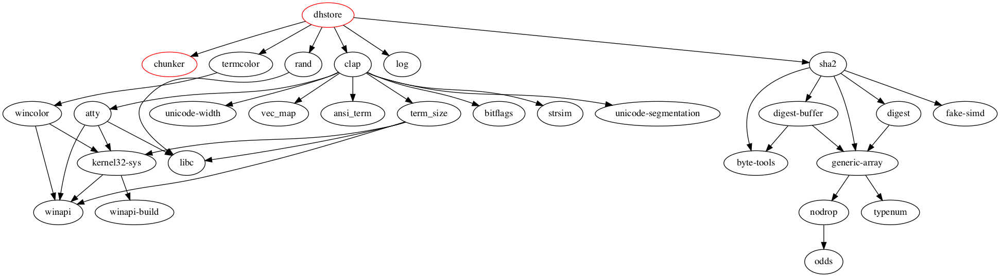

[Generated documentation](https://remram44.github.io/dhstore/index.html)

What is this?
=============

This is very early work. I am trying to write a decentralized content management system (think Git, not Wordpress) in the Rust language.

Borrowing ideas from [IPFS](https://ipfs.io/) and [Camlistore](https://camlistore.org/), my objective is to write software that can store and index objects, offering replication, sharing and search over multiple nodes.

Use cases:
* Store your backups in an efficient (de-duplicated) manner, and replicate them to different machines
* Index and tag your photos, allowing for efficient search by tag/date/location
* Ingest your Tweets and social media posts for posterity and easy search
* Wiki-like application with rich-text notes linking forward and back to images, files, emails, ...
* Persistent decentralized archive (archive.org mirror?)
* Backend for all kinds of applications (calendar, website, microblogging)

Data Model
==========

dhstore stores objects (structured, indexable documents) and blobs (bunch of bytes). An object is either a list or a dictionary with string keys, and cannot have nested containers. They can however reference other objects and blobs, allowing to store full JSON-like trees.

Everything is content-addressable (referenced by its hash) much like Git or IPFS. However, special objects called permanode allow for mutability: "claim" objects associate a permanode to a value, and can be authenticated via public-key cryptography.

For example, a permanode might be used to collect snapshots of some directory tree. Claims associate the roots of snapshots to the permanode, and can be searched by date.

Dependencies
------------

